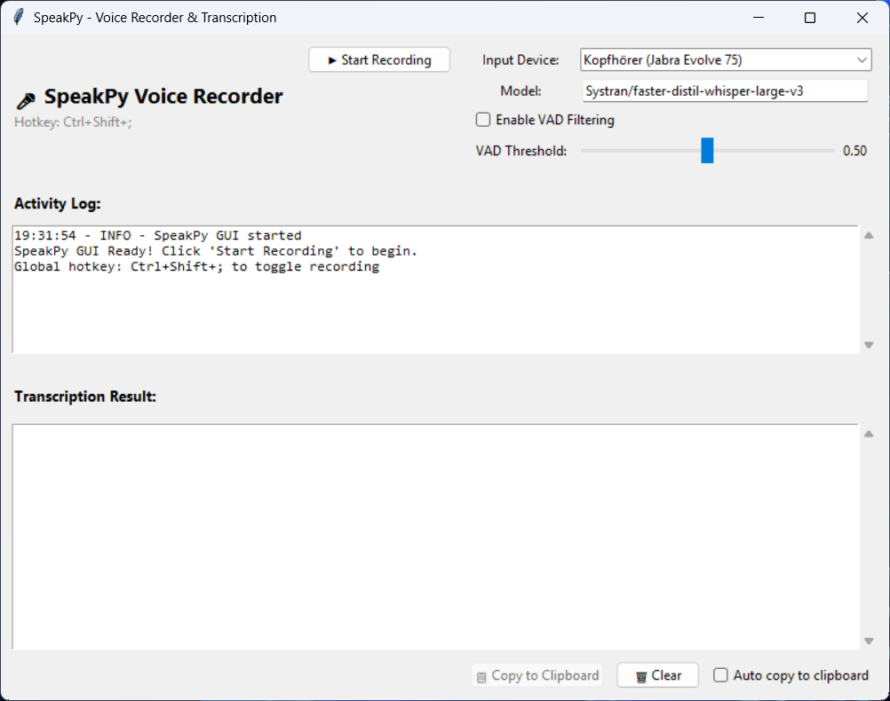

# SpeakPy

Audio recording to speech-to-text script using speaches.ai API. Record audio from your microphone, compress it with ffmpeg, and get instant transcriptions using a local speaches.ai instance.



## Features

- 🎤 **Audio Recording**: Record from any audio input device using sounddevice
- 🖥️ **GUI Interface**: Easy-to-use graphical interface with real-time feedback
- 🎙️ **Voice Activity Detection (VAD)**: Optional silence filtering using Silero VAD
- 🗜️ **Smart Compression**: Automatic silence removal and Opus encoding with ffmpeg
- 🚀 **Fast Transcription**: Uses speaches.ai (OpenAI-compatible API) with faster-whisper
- 💻 **Windows Compatible**: Works on Windows 11 without admin rights
- 📦 **Easy Management**: Uses modern `uv` package manager

## Requirements

- Python 3.9 or higher
- [uv](https://docs.astral.sh/uv/) package manager
- ffmpeg (installation instructions below)
- speaches.ai running locally (Docker)
- [torch](https://pytorch.org/) (optional, required for VAD)

## Installation

### 1. Install uv (if not already installed)

```powershell
# Windows (PowerShell)
irm https://astral.sh/uv/install.ps1 | iex
```

### 2. Clone/Download this project

```powershell
cd c:\dev\speakpy
```

### 3. Create virtual environment and install dependencies

```powershell
uv venv
.venv\Scripts\activate
uv pip install -e .
```

### 4. Install ffmpeg

**Option A: System Installation**
1. Download ffmpeg from [https://www.gyan.dev/ffmpeg/builds/](https://www.gyan.dev/ffmpeg/builds/)
2. Choose "ffmpeg-release-essentials.zip"
3. Extract the archive
4. Add the `bin` folder to your system PATH

**Option B: Portable (No Admin Required)**
1. Download ffmpeg from the link above
2. Extract the archive
3. Create a `ffmpeg` folder in the project directory
4. Copy the `bin` folder into it
5. Your structure should be: `c:\dev\speakpy\ffmpeg\bin\ffmpeg.exe`

### 5. Start speaches.ai

Make sure your speaches.ai Docker container is running:

```powershell
docker run -d -p 8000:8000 ghcr.io/speaches-ai/speaches:latest
```

## Usage

### Launch the GUI

```powershell
# Start with visible window
python speakpy_gui.py

# Start minimized to system tray
python speakpy_gui.py --tray
```

The GUI provides:
- **Simple Interface**: Click "Start Recording" button to begin, "Stop Recording" to finish
- **Live Activity Log**: See real-time feedback about recording and processing status
- **Transcription Display**: View transcription results in a dedicated text area
- **Copy to Clipboard**: One-click button to copy transcription text
- **Auto-Paste**: Automatically paste transcribed text into other applications (no admin rights required)
- **System Tray Integration**: Minimize to tray, control from system tray icon
- **Global Hotkey**: Press Ctrl+Shift+; to toggle recording from anywhere
- **Status Indicators**: Visual feedback showing current application state (Ready/Recording/Processing)

**GUI Controls:**
- Click **Start Recording** to begin capturing audio
- Speak clearly into your microphone
- Click **Stop Recording** when finished
- Wait for processing and transcription to complete
- Use **Copy to Clipboard** to copy the transcription text
- Enable **Auto copy to clipboard** checkbox to automatically paste text into focused applications
- Use **Clear** to reset the transcription area
- **Model Selection**: Edit the model field to change the transcription model (takes effect on next recording)
- **Enable VAD Filtering**: Checkbox to toggle Voice Activity Detection (silence filtering) for the next recording
- **VAD Threshold**: Slider to adjust detection sensitivity (0.0-1.0) on-the-fly

**Window Management:**
- **Close (X) Button**: Exits the application completely
- **Minimize (-) Button**: Hides window to system tray (keeps running in background)
- **System Tray Icon**: Right-click for menu options:
  - Show Window: Restore the main window
  - Start Recording: Toggle recording from tray
  - Exit: Close the application
- **Global Hotkey**: Press **Ctrl+Shift+;** anywhere to toggle recording (even when minimized)

**Auto-Paste Feature:**
When the "Auto copy to clipboard" checkbox is enabled, transcribed text will automatically:
1. Copy to clipboard
2. Simulate Ctrl+V keypress after 150ms
3. Paste into whichever application has keyboard focus (e.g., Notepad, browser, Word)

This works **without admin rights** using standard keyboard input simulation.

### Command-Line Arguments for GUI

You can customize the GUI startup behavior with these flags:

```
usage: speakpy_gui.py [-h] [--tray] [--api-url API_URL] [--model MODEL]
                      [--vad] [--vad-threshold VAD_THRESHOLD] [--keep-files]

Arguments:
  --tray                  Start minimized to system tray
  --api-url API_URL       Speaches.ai API URL (default: http://localhost:8000)
  --model MODEL           Transcription model
  --vad                   Enable Voice Activity Detection by default
  --vad-threshold THRESH  VAD sensitivity threshold (default: 0.5)
  --keep-files            Keep temporary audio files
```

## How It Works

1. **Recording**: Captures audio from your microphone using the sounddevice library
2. **VAD (Optional)**: Detects and filters voice activity in real-time using Silero VAD
3. **Compression**: Processes audio with ffmpeg:
   - Removes silence at the beginning
   - Converts to 16kHz mono
   - Encodes with Opus codec at 32kbps for minimal file size
4. **Transcription**: Sends compressed audio to speaches.ai API
5. **Results**: Displays the transcription in your console

## Troubleshooting

### "ffmpeg is not available"
- Make sure ffmpeg is installed and in your PATH
- Or place ffmpeg in the `ffmpeg/bin/` directory within the project
- Run `ffmpeg -version` to verify installation

### "Could not connect to speaches.ai"
- Check if Docker container is running: `docker ps`
- Verify port 8000 is accessible: `curl http://localhost:8000/docs`
- Make sure you're using the correct API URL

### "No input devices found"
- Check if your microphone is connected and enabled
- Check Windows sound settings

### Poor transcription quality
- Ensure good microphone quality and minimal background noise
- Try specifying the language: `--language en`
- Record for longer (speak more before pressing CTRL+C) for better context
- Check if the correct audio device is selected

## Project Structure

```
speakpy/
├── speakpy_gui.py          # Main GUI application
├── pyproject.toml          # Project configuration
├── README.md               # This file
├── src/
│   ├── __init__.py
│   ├── audio_recorder.py   # Audio recording with sounddevice
│   ├── audio_compressor.py # FFmpeg compression
│   ├── api_client.py       # Speaches.ai API client
│   ├── vad_processor.py    # Voice Activity Detection (Silero VAD)
│   ├── gui.py              # GUI components (tkinter)
│   └── utils.py            # Helper functions
└── ffmpeg/                 # Optional: portable ffmpeg
    └── bin/
        └── ffmpeg.exe
```

## Credits

- [speaches.ai](https://github.com/speaches-ai/speaches) - OpenAI-compatible STT/TTS server
- [faster-whisper](https://github.com/SYSTRAN/faster-whisper) - Fast transcription engine
- [sounddevice](https://python-sounddevice.readthedocs.io/) - Audio I/O library
- Compression technique inspired by [Epicenter](https://github.com/EpicenterHQ/epicenter)

## License

This project is free to use and modify.
